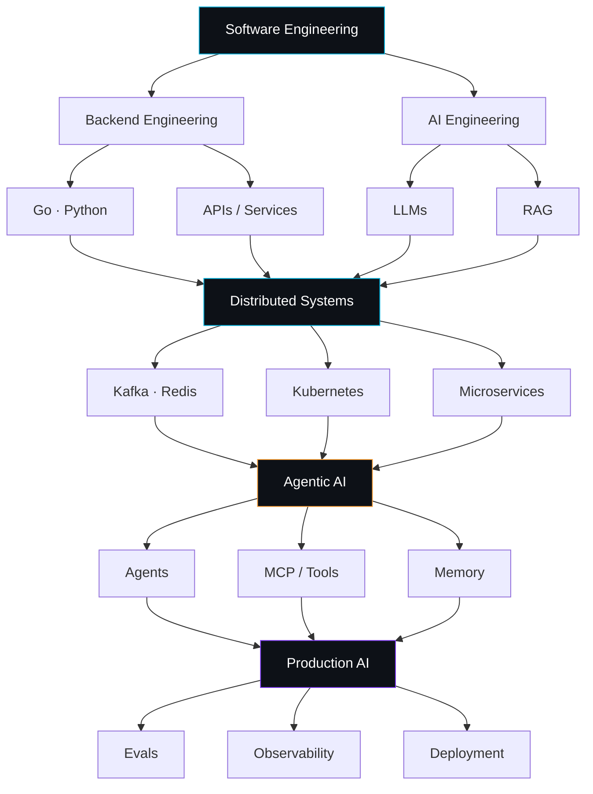
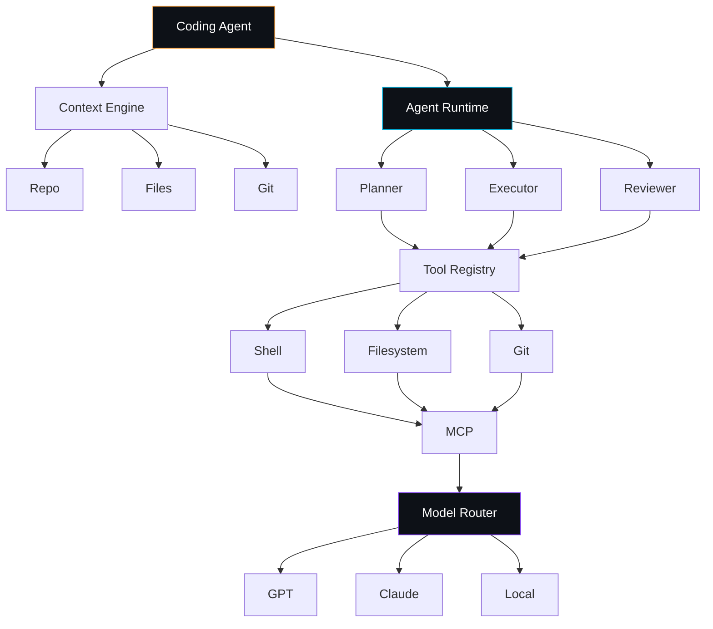

<a name="top"></a>

<div align="center">


<br>


[](#connect)

</div>

<div align="center">

<a href="#about">About</a> ·
<a href="#stack">Stack</a> ·
<a href="#architecture">Architecture</a> ·
<a href="#agentic">Agentic Focus</a> ·
<a href="#research">Research</a> ·
<a href="#projects">Projects</a> ·
<a href="#stats">Stats</a> ·
<a href="#connect">Connect</a>

</div>


<a name="about"></a>

```bash
satyajit@backend:~$ whoami
> Satyajit Samal
> role      : Backend Engineer · AI Systems Engineer · Agentic AI Builder
> stack     : Go, Python, Distributed Systems, LLMs
> currently : building a coding-agent harness from first principles
> mission   : ship production-grade systems, not toy demos
```

<a name="stack"></a>

## ⚙️ Tech I build with

<div align="center">

**Core stack**


</div>

**AI · LLM · Agentic**


**Messaging · Distributed Systems**


**Observability · MLOps**


<a name="architecture"></a>

## 🧠 How my stack fits together

Backend engineering is the foundation, AI/LLM work is the application layer, and the two meet in **agentic systems** — where I spend most of my current energy.



<a name="agentic"></a>

## 🤖 What "agentic" means in my work

```
User → Prompt → LLM → Answer                      ❌ what I'm moving away from

User → Agent → Reasoning/Planning → Tool Selection
     → Tool Execution → Observation → State/Memory
     → Verification → Final Result                 ✅ what I'm building toward
```

I'm reverse-engineering how coding-agent harnesses (Claude Code, OpenCode, Codex) work internally — context engines, planners, executors, tool registries, MCP — with the goal of building my own.




<a name="research"></a>

## 🔬 Research direction: Distributed Systems × Agentic AI

The question I keep coming back to: **how do distributed-systems principles apply to autonomous agents?**

> [!NOTE]
> - **Fault tolerance** — what happens when an agent crashes, a tool fails, a model times out, or a worker node disappears?
> - **Agent state** — how does state survive `crash → worker failure → node failure → restart` without losing progress?
> - **Orchestration** — how do you coordinate `Agent A → Agent B → Agent C → Reviewer` across distributed infrastructure?
> - **Evaluation & observability** — how do you actually measure and debug whether an autonomous agent works, end to end?

<a name="projects"></a>

## 🏗️ Featured work

<table>
<tr>
<td width="50%" valign="top">

### 🩺 AI Doctor Assistant
Multimodal (text + speech + image) AI assistant with LLM-based reasoning.

`Python` `LangChain` `Streamlit` `Groq` `OpenAI`

</td>
<td width="50%" valign="top">

### 💳 MedX — Payment Architecture (OSS)
Evolving a healthcare app's manual UPI-verification flow into a webhook-driven, gateway-verified entitlement pipeline (Razorpay / Polar / Juspay).

`Backend Architecture` `Payments` `Admin Systems`

</td>
</tr>
<tr>
<td width="50%" valign="top">

### 🧠 Agentic Coding Harness *(in progress)*
My own coding-agent runtime — context engine, planner/executor/reviewer loop, tool registry, MCP integration, model routing.

`Go` `MCP` `Agent Runtime` `Sandboxing`

</td>
<td width="50%" valign="top">

### 📊 ML CI/CD Pipeline
End-to-end model lifecycle: data → training → experiment tracking → versioning → containerized deployment.

`Docker` `DVC` `MLflow` `GitHub Actions`

</td>
</tr>
</table>


<a name="stats"></a>

## 📈 GitHub Stats

<div align="center">


</div>

<div align="center">

<picture>
  <source media="(prefers-color-scheme: dark)" srcset="https://raw.githubusercontent.com/satya-18-w/satya-18-w/output/github-contribution-grid-snake-dark.svg" />
  <source media="(prefers-color-scheme: light)" srcset="https://raw.githubusercontent.com/satya-18-w/satya-18-w/output/github-contribution-grid-snake.svg" />
  
</picture>

<!-- ☝️ Needs `.github/workflows/snake.yml` (provided separately) to actually generate -->

</div>

<br>

<div align="center">

<a href="https://github.com/satya-18-w/satya-18-w">
  
</a>

</div>


## 🗺️ Currently

- 🔭 Building production-grade backend systems in **Go** — no toy examples, full request-lifecycle implementations
- 🌐 Studying distributed-systems failure modes and how they apply to long-running autonomous agents
- 🤝 Contributing to open-source healthcare tooling (MedX)
- 🧪 Building evaluation & observability pipelines for RAG and agent systems, not just shipping a chatbot demo
- 📫 Open to collaborating on **agentic infrastructure**, **Go backend systems**, or **production RAG/agent evaluation**

<a name="connect"></a>

## 🔗 Connect

<div align="center">

[](https://github.com/satya-18-w)
[](https://linkedin.com/in/satyajit-samal-b125a02a4)
[](https://iamsatya.in/)
[](satyajitsamal198076@gmail.com)

<sub>⚠️ Replace the `#` links above with your actual LinkedIn / X / portfolio / email URLs before publishing.</sub>

</div>


<div align="center">
<sub><a href="#top">back to top ↑</a></sub>
</div>
